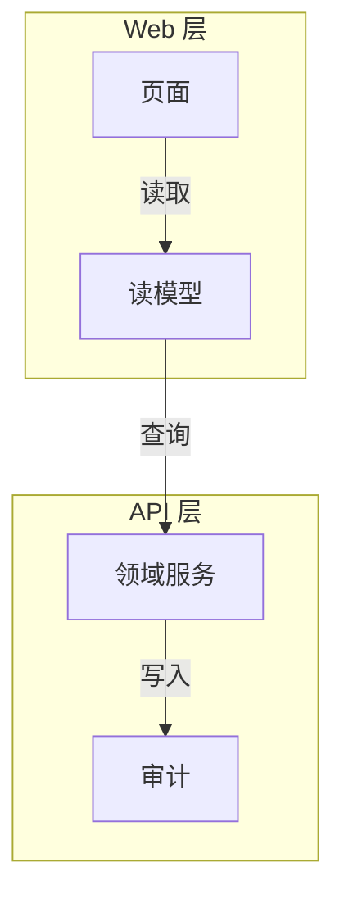

# Diagram Guide

Choose diagrams intentionally. Do not add diagrams just to decorate the report.

## Default Expectation

For report work, diagrams are part of the explanation, not decoration.

- If the report explains a framework, architecture, pipeline, lifecycle, protocol, or multi-step process, add a diagram by default.
- If the reader would otherwise need to mentally reconstruct the structure from a long paragraph, draw it.
- If the topic is simple enough to be obvious in one sentence, a diagram is optional.
- If the report reuses a paper figure, chart, or repository screenshot, decide whether the borrowed figure is only evidence or also good pedagogy. If it is evidence-heavy but teaching-poor, add an original explanatory diagram.
- Treat the report as `图文并茂` by default: major chapters should normally contain a visual aid, a table, or both.

## Diagram Focus

Choose the figure type by the question the section must answer.

- boundary or layer split -> TikZ architecture or framework diagram
- cross-module interaction order -> TikZ sequence diagram
- data movement or projection -> Mermaid flowchart source, unless final PDF rendering lacks a verified Mermaid path
- lifecycle, state transition, gate decision, retry, or recovery semantics -> TikZ logic framework diagram
- comparison, trade-off, or evidence summary -> table or PGFPlots

The center of gravity is the question, not the diagram family. If the section answers a different question, change the diagram type.

## LaTeX PDF Choice

When this report family compiles to PDF, the default path for final diagrams is TikZ or PGFPlots so that figures stay typographically native, vector-clean, and editable inside the LaTeX workflow.

The Markdown artifact is generated from the same LaTeX source. It may expose figure source references for readability, while the PDF remains the visual acceptance artifact for diagram layout, labels, captions, and typography.

Use TikZ when you want:

- publication-grade layout control
- exact node spacing or arrow placement
- diagram styles that visually match the report body font and caption system
- reusable figure styles across multiple reports
- architecture, framework, pipeline, lifecycle, protocol, and paper-ready mechanism figures

Use PGFPlots when you need:

- trend charts
- confidence bands
- grouped comparisons
- log axes, subplots, or experiment-ready statistical figures

Use Mermaid when you want:

- fast iteration during brainstorming
- a temporary sketch before the final TikZ figure is committed
- a compact draft that will likely be replaced later
- a low-risk quick diagram when layout precision is not important
- a dataflow or projection source that the current report workspace can render reproducibly into the final PDF

Do not use Mermaid to rescue an overcrowded diagram. If the figure has too many nodes, too many branches, or more than one main takeaway, split it into an overview figure and one or more detail figures instead of making the Mermaid graph denser.

For final report delivery, the default preference order is:

1. TikZ / PGFPlots
2. tabular or longtable based comparison tables
3. Mermaid source figures only for dataflow/projection diagrams, fast-changing sections explicitly accepted by the user, or workspaces with a verified Mermaid-to-PDF render path

## TikZ First Setup

The default TikZ stack for this report family should include:

- `arrows.meta`
- `positioning`
- `calc`
- `decorations.markings`
- `decorations.pathmorphing`
- `backgrounds`
- `fit`
- `quotes`
- `shapes.geometric`
- `shapes.misc`
- `matrix`
- `3d`

Recommended global style families:

- `reportnode`
- `reportprocess`
- `reportdecision`
- `reportgroup`
- `reportarrow`

These styles should live in `style.tex` so diagrams across reports keep a coherent visual language.

## Decode-Compatible Mermaid Style

When Mermaid is used as a draft medium, match the `decode` skill convention:

- default to `flowchart TB`
- write subgraphs as `subgraph id["中文标题"]`
- keep node IDs ASCII-only
- keep node display text in concise Chinese
- keep edge labels short and action-oriented
- use `sequenceDiagram` only for brainstorming drafts when time order is the key message; final report delivery should normally redraw it in TikZ

Baseline example:



## Decode-Derived Visual Strategy

The `decode` skill uses a strong default diagram grammar that works well for engineering reports too. Adopt these rules unless the section has a compelling reason to do otherwise.

### Default Narrative Order

When a topic has internal structure, use this reading order:

1. one compact overview diagram first
2. one detail diagram per important layer, module cluster, flow, or integration cluster
3. one timing or message-order diagram only when execution order is itself a key question

This keeps the reader's mental model stable: boundary first, detail second, execution order third.

### One Figure, One Question

Each figure should answer one main question.

Good figure questions:

- What are the system boundaries?
- How do the layers divide responsibility?
- How does this module split into components?
- In what order do these actors interact?
- How does data change state?

If a figure tries to answer structure, timing, and trade-offs at once, split it.

### Structure And Order Must Be Separated

When the section needs both static structure and runtime order:

- use one architecture or dependency figure for structure
- use one sequence or workflow figure for order
- keep the table for contracts, definitions, or trade-offs

Do not hide message order inside a dense structure figure, and do not overload a sequence diagram with module taxonomy.

### Split Triggers

Split the figure into overview plus detail when any of these is true:

- more than 9 nodes
- more than 1 main takeaway
- overview and deep implementation details are mixed together
- one layer has more than 5 internal nodes
- one layer depends on more than 2 external systems
- the diagram needs both static boundaries and runtime order

### Figure Roles

Use different figure types for different explanatory jobs:

| Figure type | Main question | Typical content |
| --- | --- | --- |
| overview diagram | What exists and where are the boundaries? | actors, layers, external systems |
| layer detail diagram | How is one layer internally organized? | services, repos, gateways, adapters |
| module architecture diagram | How do components inside one module divide work? | component groups, dependency direction |
| workflow or sequence diagram | In what order does one action proceed? | calls, decisions, retries, handoffs |
| dataflow or state diagram | How does data move or evolve? | entities, transitions, projections |
| logic framework diagram | Which states and guarded transitions are legal? | lifecycle states, decision gates, retry, stale recovery |
| comparison table | How do alternatives differ? | options, risks, conclusions |

## Fixed Visual Grammar

Keep the visual language stable across reports so readers can reuse the same mental model.

### Framework Diagrams

Framework diagrams should default to a top-down reading order, and the final preferred implementation is TikZ.

- Use TikZ node styles with a top-down hierarchy
- Use a compact three-step structure when possible:
  - overall goal or system boundary
  - module split or layer split
  - key relation, handoff, or dependency
- Keep node labels short and role-based
- If the figure gets crowded, split it into an overview diagram and one detail diagram
- Prefer explicit system boundaries, layers, decision nodes, and message flow when the report is engineering-heavy

TikZ design goals:

- typographically consistent with the main text
- easy to reuse as a figure style family
- clean enough for paper and report submission
- stable under XeLaTeX compilation

### Sequence Diagrams

Use sequence diagrams only when message order is the important thing. Prefer TikZ for final report delivery when the timing figure is part of the canonical artifact.

- Keep participants stable and few
- Write each message as a short action phrase
- Show request, decision, response, or feedback explicitly
- Use `alt` only for real branch points
- Do not hide the core flow under implementation noise

### Logic Framework Diagrams

Use logic framework diagrams when the report must make state rules, lifecycle constraints, or guarded transitions auditable. Prefer TikZ for final report delivery.

- Use `logic-framework-template.md` when a figure resembles the Ares Signal Delivery or Execution Task state diagrams.
- Show only legal states and legal transitions.
- Use `reportdecision` for blocking gates such as risk, approval, authorization, quota, or validation decisions.
- Use dashed arrows for retry, timeout, stale recovery, or compensation.
- Keep captions constraint-oriented: state which status is consumable, which branch terminates, or which gate blocks execution.
- Split message timing into a separate sequence diagram when the reader also needs cross-module order.

### TikZ Sequence Diagram Guidance

For final report delivery, default to TikZ sequence diagrams when the reader must understand cross-module interaction order.

- When a sequence diagram contains a blocking decision point before an irreversible action, use `sequence-diagram-template.md`. It generalizes the Ares signal-to-order exemplar into a reusable grammar: trigger, ingest, queue or delivery, orchestrator, blocking gate, side effect.
- Keep the main path to 4 to 8 participants
- Separate retry, timeout, compensation, or failure branches into another figure when they would crowd the main path
- Place the figure in `core module design`, `core workflow`, or `implementation walkthrough`, depending on what question it answers
- Treat screenshots or Mermaid drafts as semantic references and redraw them in TikZ when the figure is part of the canonical report
- Keep captions conclusion-oriented: state what the timing figure proves about the system

Recommended write-back shape:

```latex
\begin{figure}[H]
\centering
\input{figures/<diagram-slug>.tex}
\caption{[对象]，突出[读者应注意的结论]。}
\label{fig:<diagram-slug>}
\end{figure}
```

#### TikZ Sequence Diagram Template

Use this template for consistent, typographically native sequence diagrams. Key rules:

- Define participants with explicit `(x, 0)` coordinates using the `x=` scale.
- Draw lifelines as vertical dashed lines at the same x-coordinates.
- **Never use `(node)+(offset)` for message arrows** — TikZ does not parse this reliably in `\draw`. Use direct `(x, y)` coordinates instead.
- Use `-{Latex[length=2.4mm,width=1.6mm]}` for clean arrowheads.
- Keep message labels short and action-oriented; place with `node[above]` or `node[below]`.

```latex
\begin{tikzpicture}[
  x=2.65cm,          % horizontal spacing between participants
  y=0.72cm,          % vertical spacing between messages
  every node/.style={font=\small},
  lifeline/.style={draw=ReportGray, dashed},
  msg/.style={-{Latex[length=2.4mm,width=1.6mm]}, thick, draw=ReportBlueDark},
]
% Participants
\node (hirer)  at (0,0) {Hirer};
\node (api)    at (1,0) {Platform API};
\node (relay)  at (2,0) {Relay};
\node (store)  at (3,0) {Session Store};
\node (worker) at (4,0) {Worker Daemon};

% Lifelines
\foreach \x in {0,1,2,3,4} {\draw[lifeline] (\x,-0.4) -- (\x,-7.6);}

% Pre-condition: worker is already connected (daemon mode)
\draw[msg, dashed, draw=ReportGray] (4,-0.8) -- node[above]{WebSocket + lease proof（常驻）} (2,-0.8);

% Main flow — start from task creation
\draw[msg] (0,-2) -- node[above]{创建调用任务} (1,-2);
\draw[msg] (1,-3) -- node[above]{publish session.assign} (2,-3);
\draw[msg] (2,-4) -- node[above]{分配 sequence / 存入 buffer} (3,-4);
\draw[msg] (2,-5) -- node[above]{按 sequence 推送} (4,-5);
\draw[msg] (4,-6) -- node[above]{session.ack / result} (2,-6);
\draw[msg] (2,-7) -- node[above]{ack 截断} (3,-7);
\end{tikzpicture}
```

### Tables

Tables should compress comparison, definition, or evidence, not replace narrative explanation.

- Prefer question-oriented column names such as `维度`, `方案`, `含义`, `结论`, `风险`
- Use tables for contrasts, baselines, checklists, and symbol definitions
- Keep each row parallel so the reader can compare quickly
- If the table is doing more than one job, split it

Example shape:

| 维度 | 方案 A | 方案 B | 结论 |
| --- | --- | --- | --- |
| 可读性 | 高 | 中 | 优先选 A |
| 成本 | 中 | 低 | 视场景决定 |

### Figure Narrative

Every figure should have a stable narrative wrapper.

1. Introduce it before the figure appears.
2. Explain why the reader needs it.
3. Add a caption that states the conclusion.
4. Refer back to it in the following paragraph.

Caption pattern:

`图 X. [对象]，突出 [读者应注意的结论]。`

## Progressive Disclosure

Do not try to compress a whole system into one crowded figure.

1. Start with one compact overview diagram.
2. Add one detail diagram per important layer, flow, or integration cluster.
3. Split a diagram when:
   - it has more than 9 nodes
   - it mixes overview and deep implementation details
   - it has more than one main takeaway
4. Omit detail diagrams only when the layer is trivial or has no meaningful internal structure.

For long technical reports, the default visual stack should usually be:

1. one TikZ overview diagram
2. one TikZ mechanism, protocol, or workflow diagram
3. one PGFPlots chart or comparison table when empirical claims matter

## Diagram Selection

Use `TikZ` for:

- architecture diagrams
- framework diagrams
- pipeline diagrams
- sequence diagrams for final report delivery
- protocol diagrams
- lifecycle diagrams
- layered system diagrams
- decision-flow diagrams
- paper-ready mechanism figures

Use `PGFPlots` for:

- experiment curves
- confidence intervals
- grouped bar charts
- ablation charts
- multi-axis or multi-panel statistical figures

Use `Mermaid` for:

- workflow diagrams
- dataflow diagrams
- state diagrams
- dependency graphs
- concept maps
- C4-style overview maps
- request or event fan-out
- control-plane vs execution-plane boundaries

Mermaid should usually stop at the draft stage unless it is a dataflow/projection diagram, the user explicitly accepts it as the final artifact, or the workspace has a verified Mermaid-to-PDF render path.

## TikZ Advice

Keep final TikZ figures disciplined:

- one main message per figure
- consistent node styles across the report
- consistent arrow grammar across the report
- use `positioning` and `fit` instead of hand-tuning every coordinate
- prefer overview-plus-detail over one oversized figure
- when the figure encodes engineering boundaries, draw the boundary explicitly

## Mermaid Advice

Keep Mermaid diagrams simple:

- one main message per diagram
- 5 to 9 nodes is a good default
- label arrows with verbs, not paragraphs
- avoid deeply nested subgraphs unless absolutely necessary
- prefer a compact Mermaid draft over a complex single-picture solution
- if the layout or spacing must be exact, switch to TikZ immediately rather than stretching Mermaid

Good uses:

- end-to-end pipelines
- feedback loops
- module interactions
- training or inference flow
- layered architecture
- protocol stages

Bad uses:

- dense mathematical notation
- crowded experimental figures
- tables disguised as flowcharts
- one huge architecture picture that tries to answer every question at once

## Section-to-Figure Mapping

Use this default mapping when the report contains the relevant section types:

- architecture / system overview -> 1 TikZ overview diagram + 1 to 3 TikZ layer detail diagrams
- core module design -> 1 module overview diagram for the chapter, then each module gets 1 architecture diagram + 1 component table + 1 I/O contract table + 1 sequence or workflow figure + 1 design decision table
- workflow / pipeline -> 1 TikZ flow or sequence diagram + 1 compact step table + 1 exception table when failure handling matters
- interfaces and data model -> 1 dataflow diagram + 1 entity or field table + 1 state diagram + 1 error-code table
- algorithm or protocol -> 1 TikZ main-loop figure, plus a timing or message-order figure when interaction order matters
- experiment setup -> 1 TikZ setup diagram or dataflow figure
- experiment critique or redesign -> 1 claim-baseline-metric matrix, table, or PGFPlots evidence map
- comparison section -> 1 table, and add a diagram only if the structure is hard to explain textually

If a section mixes "results", "critique", and "next-step plan", do not force everything into one picture. Prefer:

- one figure that explains what exists now
- one table or matrix that explains what should be added next

## Captions And Narrative

Caption formula:

`图 X. [对象]，突出 [读者应注意的结论]。`

Examples:

- `图 3. 训练流程，突出数据筛选与参数更新的闭环关系。`
- `图 5. 模块依赖关系，突出评估器与调度器的解耦边界。`

For each figure:

1. Introduce it before the figure appears.
2. Add a caption that says what the reader should notice.
3. Refer back to it in the following paragraph.
4. State the takeaway explicitly after the figure.

## Fallbacks

If Mermaid is unavailable:

1. Use a static SVG or PNG.
2. Convert the idea into a table.
3. Replace the diagram with a numbered process list.

Choose the fallback that preserves the core explanation, not the original aesthetics.
