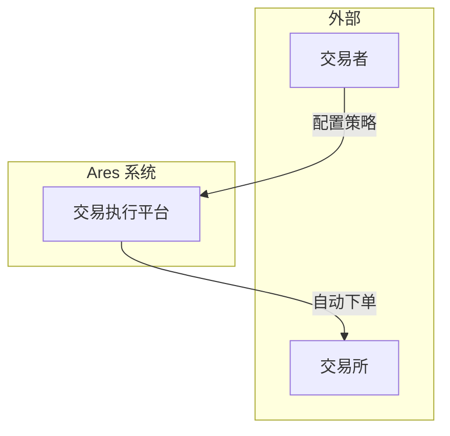
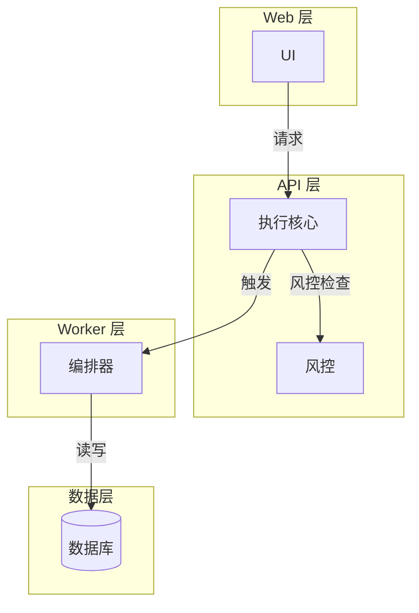
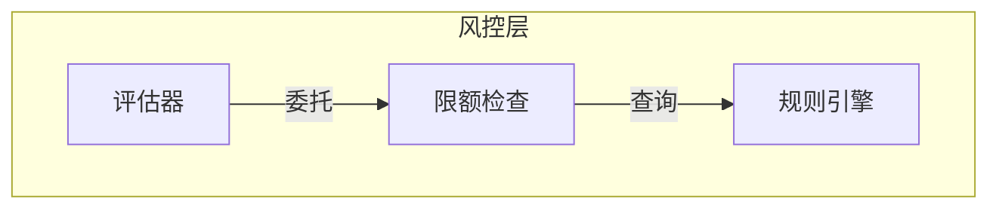

# 渐进式心智构建叙事（图解驱动版）

本文件约束 `executor-handbook` 等报告中「如何一层层铺开系统」的叙事。**核心变化：以图解驱动层次展开，而非文字堆砌。**

每一层的展开必须通过图来实现，文字只负责"图前引导"和"图后结论"。

---

## 叙事模式

默认分四层展开，**每层标配一张图**：

| 层级 | 内容 | 标配图 | 节点数限制 |
|------|------|--------|-----------|
| 层 0 | 最简心智模型：系统可以看作什么？ | 三方块总览图 | ≤ 3 |
| 层 1 | 核心拆解：读路径 vs 写路径 | 分层架构图 | ≤ 6 |
| 层 2 | 关键模块展开 | 模块架构图 × N | 每图 ≤ 6 |
| 层 3 | 关键流程展开 | 时序图 / 流程图 | 每图 ≤ 9 |

四层不是固定步数，复杂度低的报告可能止步在层 2；复杂度高的报告可能在层 3 后再切换章节继续。

**核心原则**：如果某一层找不到"对应的图"，说明这一层不需要展开。

---

## 每一层的三问 + 一图

每层叙事应显式回答：

1. **本层解决什么**：作者希望读者在本层建立的最小判断是什么
2. **本层隐藏了什么**：本层为了可读而暂时省略了哪些复杂度
3. **下一层要补什么**：接下来的章节或小节会补上本层省略掉的哪些东西
4. **本层的图是什么**：用哪张图来承载本层的核心信息

当某一层找不到这四问的任何一问，判为叙事缺口，需回到作者端补足。

---

## 与章节的映射

### 默认启用渐进式披露的章节

| 章节 | 层 0 | 层 1 | 层 2 | 层 3 |
|------|------|------|------|------|
| `01-mental-model-overview` | ✅ 总览图 | ✅ 分层图 | ⚠️ 可选 | ❌ 不展开 |
| `04-system-architecture` | ❌ 已在 01 | ✅ 承接 01 | ✅ 模块图 | ✅ 流程图 |

### 不启用渐进式披露的章节

以下章节按「问题 → 决策 → 代价」线性结构展开，不使用层次化叙事：

- `05-core-design-and-tradeoffs`
- `06-algorithm-and-workflow`
- `09-risks-and-delivery`

这些章节的核心是**对比和决策**，不是**层次展开**。

---

## 图解骨架（decode 兼容）

### 图 1：总览图（层 0）

**目标**：让读者一眼知道系统是什么、解决什么问题。

**规范**：
- 节点数 ≤ 3（三个大方块或三个角色）
- 只展示：系统边界、主要参与者、核心外部依赖
- 不要展示内部模块

**示例**：


### 图 2：分层图（层 1）

**目标**：展示系统的主要层级和职责边界。

**规范**：
- 节点数 ≤ 6
- 展示：层级聚合、层间依赖、数据流向
- 每个层级用一句话标注职责

**示例**：


### 图 3：模块图（层 2）

**目标**：展示某一层的内部模块分解。

**规范**：
- 每图节点数 ≤ 6
- 使用 MECE 分解
- 每个模块用一句话标注职责
- 模块间依赖用箭头标注动作

**示例**：


### 图 4：时序图（层 3）

**目标**：展示跨模块的交互流程。

**规范**：
- 参与者 ≤ 6
- 只展示核心流程，隐藏错误分支（另开图）
- 每条消息用动词标注
- 关键决策点用注释标注
- 正式报告默认使用 TikZ；Mermaid 仅用于 brainstorming 草图

**示例**：
```latex
\begin{figure}[H]
\centering
\input{figures/<sequence-slug>.tex}
\caption{[对象]，突出[读者应注意的结论]。}
\label{fig:<sequence-slug>}
\end{figure}
```

---

## 图前图后写法

### 图前引导

不要只说"如下图所示"。要说清楚：

1. **这张图回答什么问题**
2. **读者应该关注什么**

**正确**：
```markdown
信号从生成到订单落地的完整链路如图 X 所示。读者应关注三个决策点：
风控评估、账户验证、交易所响应超时处理。
```

**错误**：
```markdown
系统的流程如下图所示。
```

### 图后结论

图后必须有一句话总结读者应该从图中带走的判断。

**正确**：
```markdown
图 X 显示，风控决策是执行主路径中的阻塞点：任何信号必须通过风控评估
后才能进入下单环节。这一设计确保风控不可绕过。
```

**错误**：
```markdown
如图 X 所示，这是系统的流程。
```

---

## 禁止模式

- **把总览、分层、机制挤在同一张图里** → 拆成多张
- **在层 0 就引入所有专有名词** → 层 0 只用通俗角色名
- **三问只写一问** → 常见坏味道是只写"本层解决什么"
- **在非渐进式章节硬塞层次化叙事** → 让结论被拖长
- **有层无图** → 任何一层如果没有对应的图，删除该层
- **图后无结论** → 每张图后必须有一句总结

---

## 自检提示

写回后至少扫一遍：

- [ ] 每一层是否有对应的图？
- [ ] 图 1、图 2、图 3 是否共享节点风格与命名？
- [ ] 层 0 是否控制在 3 个节点以内？
- [ ] 层 1 是否控制在 6 个节点以内？
- [ ] 层 2 的每张模块图是否控制在 6 个节点以内？
- [ ] 层 3 的时序图是否控制在 6 个参与者以内？
- [ ] 每张图前是否有引导句（说明图回答什么问题）？
- [ ] 每张图后是否有结论句（说明读者应带走什么判断）？
- [ ] 层 2 结束时，读者是否已能用自己的话复述系统的主结构？
- [ ] 是否有层没有图？如果有，删除该层或补图
